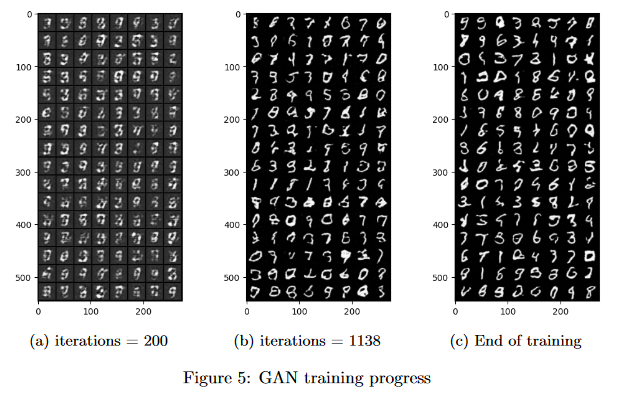
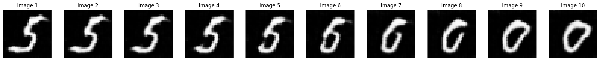

# Generative Adversarial Network 

Generative Adversarial Networks (GANs) have marked a significant milestone in
the realm of generative vision models, being the first of their kind with a proven
ability to deceive human perception. In this project, we aim to build from scratch a GAN and its conditional variants (more specifically [DCGAN](https://arxiv.org/abs/1511.06434)).
We will train them on MNIST, compare them and perform various experiment.

## How to use

The [notebook](2_d_GANs.ipynb) can be used to reproduce every experiment on its own. Using colab, no other installation is required. 

[GANclass.py](GANclass.py) contains all necessary class. 

[train_GAN.py](train_GAN.py) train a cGAN with the defaults parameters and save it. 

## Unconditional GAN 

### Training Progress

After only 200 iterations, we can see that the generated image are still very
noisy, with the background being gray, not black. Some digits are almost
recognisable, especially 9, 8 and 3. Most image are illegible however.
After 1000 iterations, the image is clearer, with a sharply defined black
background. 
More image are recognisable and with more diversity : All
digits except 2 seems to be represented. However, most of them are still
really rough with a lot of completely unrecognisable digit.
At the end of training, we can see that our generator was able to create a
large diversity of digits : from 0 to 9 all digits are able to be generated.
However, from this example, some digits seems to be more rare than others: there is almost no 2. 
Some generation are also still unrecognizable.

### Interpolation
Let’s see what happen when we generate from the results of the
interpolation between two noise vector z1 and z2.

We can see that the Image 1 progressively morph into Image 2. 
That shows us that distance in the latent z space is equivalent to a ”semantic distance” in the X (Image) world, i.e. close z vectors generate similar image.

### CIFAR10 
Let's see if our model is able to handle a more complex dataset : CIFAR10 

 

## Conditional GAN

